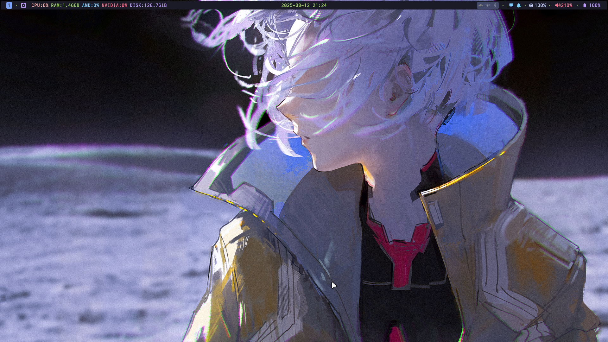

## niri-dots (Arch Linux)

Dotfiles plus an interactive terminal installer.

If you only need the wallpaper assets, see `assets/wal/`.

### Preview



## What the installer does

- Tweaks pacman (Color and Parallel Downloads)
- Adds Chaotic-AUR repo (keyring + mirrorlist)
- Installs prerequisites (base-devel, git, curl, wget, rsync, etc.)
- Installs paru (AUR helper) if missing
- Installs packages from `install/pkg.txt` plus auto-detected CPU/GPU vendor package lists using paru (deduplicated)
- Symlinks repo `.config/` to `~/.config/` and syncs `.local/` into `~/.local/`
- Copies wallpapers from `assets/wal/` to `~/.local/share/wallpapers/`
- Installs the tracked `ly` config into `/etc/ly/config.ini`
- Enables available services: `ly`, `iwd`, `power-profiles-daemon`
- Refreshes the font cache


## Install

1) Clone the repo

```bash
git clone https://github.com/jr4dh3y/dots-niri.git "$HOME/code/dots-niri"
cd "$HOME/code/dots-niri"
```

2) Optionally edit package lists

- `install/pkg.txt` for the main package list
- `install/pkg-cpu-intel.txt` / `install/pkg-cpu-amd.txt` for CPU microcode
- `install/pkg-gpu-intel.txt` / `install/pkg-gpu-amd.txt` / `install/pkg-nvi.txt` for GPU-specific packages

3) Run the installer

```bash
chmod +x install/install.sh
./install/install.sh
```

By default the installer opens a keyboard-driven terminal UI with arrow-key navigation, space-to-toggle checkboxes, and enter-to-confirm so you can choose between a full install and a custom run.

### One-line bootstrap

If you want a single URL that clones/updates the repo into `~/code/dots-niri` and then opens the regular installer UI, use `oneline.sh`:

```bash
curl -fsSL https://jr4.in/niri | bash
```

or:

```bash
wget -qO- https://jr4.in/niri | bash
```

You can also forward installer flags after the shell separator `--`:

```bash
curl -fsSL https://jr4.in/niri | bash -s -- --sync-only
```

During install, the script will also ask for the weather widget location. You can enter a city, state, full address, or pincode.

The installer auto-detects:

- CPU vendor and installs the matching microcode package (`intel-ucode` or `amd-ucode`)
- GPU vendor(s) and installs matching graphics packages for Intel, AMD/Mesa, and/or NVIDIA

## Post-install tips

- Switch your shell to fish (optional): `chsh -s /usr/bin/fish`
- Change wallpaper: `wallpaper ~/.local/share/wallpapers/<file>`

### Switching desktop rices

Niri has separate `config-waybar.kdl` and `config-quickshell.kdl` profiles. The
small `config.kdl` bootstrap loads the persisted selection at login:

```bash
rice status
rice waybar
rice quickshell
rice toggle
rice reload
```

QuickShell is the default. Its checkout is expected at
`~/code/random/nshell/shell`; set `NONCHALANT_SHELL_PATH` if it lives elsewhere.
The switcher loads the matching Niri profile and keeps Waybar/Dunst and
QuickShell from competing for the tray and notification D-Bus services. The
Waybar profile starts `awww` and binds `Mod+Shift+W` to WallpyGUI. The
QuickShell profile stops `awww`, leaves that binding unused, and relies on the
wallpaper manager in the QuickShell dashboard (`Mod+D`).

| Binding | Waybar profile | QuickShell profile |
| --- | --- | --- |
| `Mod+A`, `Mod+Period` | Fuzzel | Nonchalant launcher |
| `Mod+D` | `btop` in Kitty | Nonchalant dashboard |
| `Mod+C` | Project Picker | Nonchalant projects |
| `Mod+Grave` | T3 Code | Nonchalant assistant |
| `Mod+X` | Wlogout | Nonchalant power menu |
| `Mod+L` | Swaylock | Nonchalant lock screen |
| `Mod+Z` | Toggle Waybar | Reload QuickShell |
| `Mod+Shift+W` | WallpyGUI | Managed in dashboard |
| `Mod+Space`, `Alt+Space` | Local/cloud transcription | Unbound |
| Media and brightness keys | System commands with Dunst OSD | Nonchalant OSD |

Only the five named workspaces are bound (`web`, `dev`, `chat`, `media`, and
`vm`). Niri still keeps one empty dynamic workspace, but it will no longer
create the extra numbered 6–9 workspaces from these profiles.

## Troubleshooting

- Pacman is locked: remove the stale DB lock: `sudo rm -f /var/lib/pacman/db.lck`
- Chaotic-AUR key issues: ensure keyserver access or re-run the installer; it retries key import and installs the keyring package.
- AUR build failures: re-run just that package with `paru -S <pkg>` to see full logs.

## Uninstall/rollback notes

- The installer backs up any existing `~/.config/<name>` as `<name>.bak` before linking. You can restore from those `.bak` folders if needed.

---

Made for personal use; adapt as needed. PRs/issues welcome.
